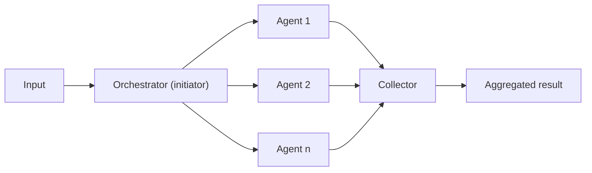

```mermaid
%% Fan-out/fan-in: the orchestrator distributes the same input and aggregates the results
flowchart LR
    E["Input"] --> O["Orchestrator (initiator)"]
    O --> A1["Agent 1"]
    O --> A2["Agent 2"]
    O --> A3["Agent n"]
    A1 --> C["Collector"]
    A2 --> C
    A3 --> C
    C --> R["Aggregated result"]
```
