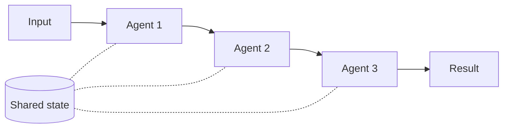

```mermaid
%% Linear pipeline: each agent consumes the previous agent's output
flowchart LR
    E["Input"] --> A1["Agent 1"]
    A1 --> A2["Agent 2"]
    A2 --> A3["Agent 3"]
    A3 --> R["Result"]
    S[("Shared state")] -.- A1
    S -.- A2
    S -.- A3
```
