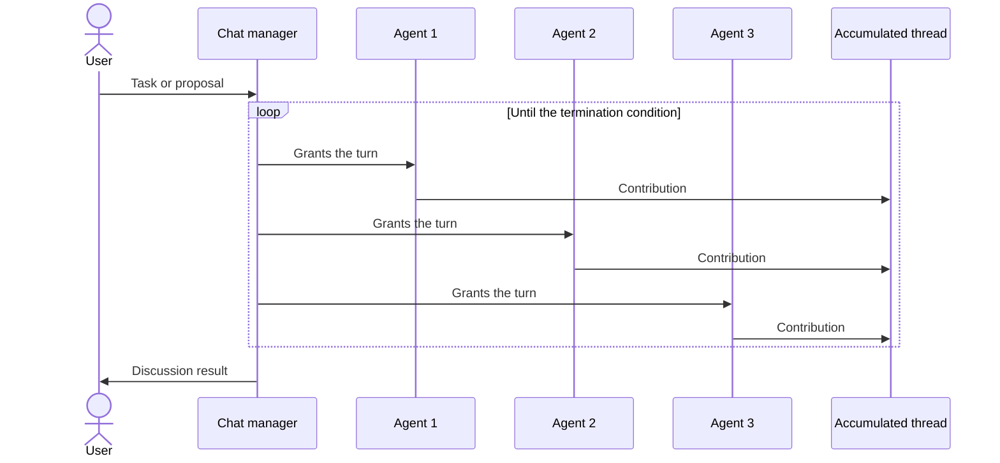

```mermaid
sequenceDiagram
    actor U as User
    participant M as Chat manager
    participant A1 as Agent 1
    participant A2 as Agent 2
    participant A3 as Agent 3
    participant T as Accumulated thread
    U->>M: Task or proposal
    loop Until the termination condition
        M->>A1: Grants the turn
        A1->>T: Contribution
        M->>A2: Grants the turn
        A2->>T: Contribution
        M->>A3: Grants the turn
        A3->>T: Contribution
    end
    M->>U: Discussion result
```
