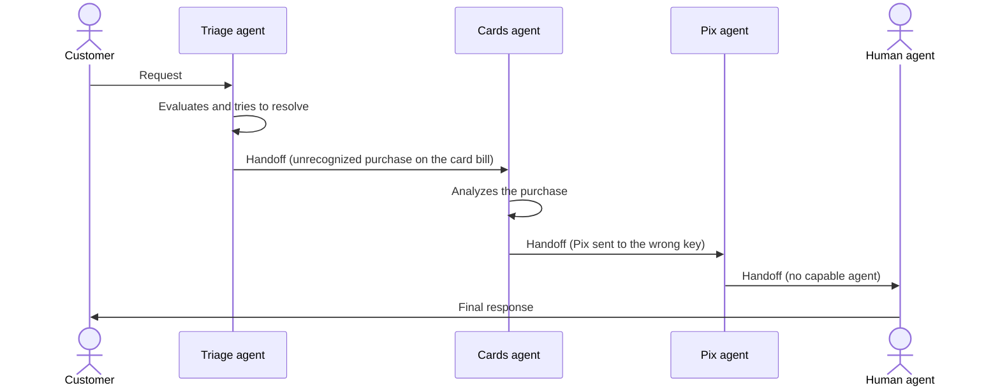

```mermaid
sequenceDiagram
    actor U as Customer
    participant T as Triage agent
    participant I as Cards agent
    participant F as Pix agent
    actor H as Human agent
    U->>T: Request
    T->>T: Evaluates and tries to resolve
    T->>I: Handoff (unrecognized purchase on the card bill)
    I->>I: Analyzes the purchase
    I->>F: Handoff (Pix sent to the wrong key)
    F->>H: Handoff (no capable agent)
    H->>U: Final response
```
