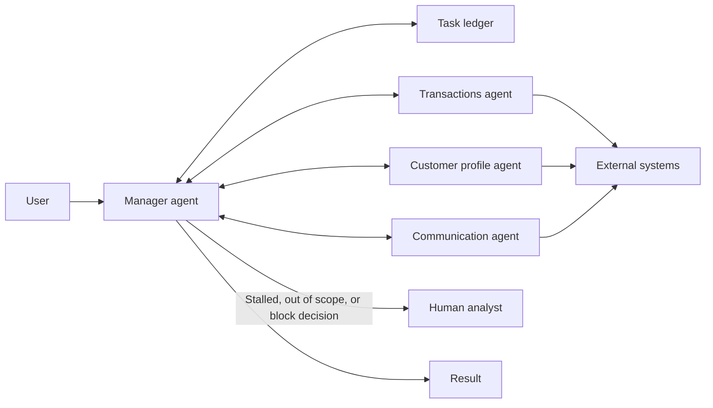

```mermaid
flowchart LR
    U["User"] --> M["Manager agent"]
    M <--> L["Task ledger"]
    M <--> A1["Transactions agent"]
    M <--> A2["Customer profile agent"]
    M <--> A3["Communication agent"]
    A1 --> S["External systems"]
    A2 --> S
    A3 --> S
    M -->|"Stalled, out of scope, or block decision"| H["Human analyst"]
    M --> R["Result"]
```
