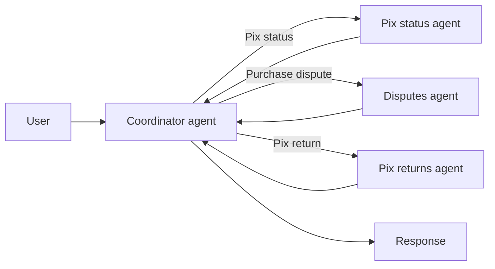

```mermaid
flowchart LR
    U["User"] --> C["Coordinator agent"]
    C -->|"Pix status"| A1["Pix status agent"]
    C -->|"Purchase dispute"| A2["Disputes agent"]
    C -->|"Pix return"| A3["Pix returns agent"]
    A1 --> C
    A2 --> C
    A3 --> C
    C --> R["Response"]
```
