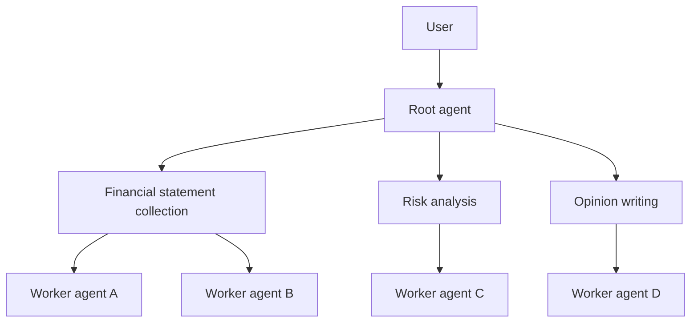

```mermaid
flowchart TD
    U["User"] --> R["Root agent"]
    R --> S1["Financial statement collection"]
    R --> S2["Risk analysis"]
    R --> S3["Opinion writing"]
    S1 --> W1["Worker agent A"]
    S1 --> W2["Worker agent B"]
    S2 --> W3["Worker agent C"]
    S3 --> W4["Worker agent D"]
```
