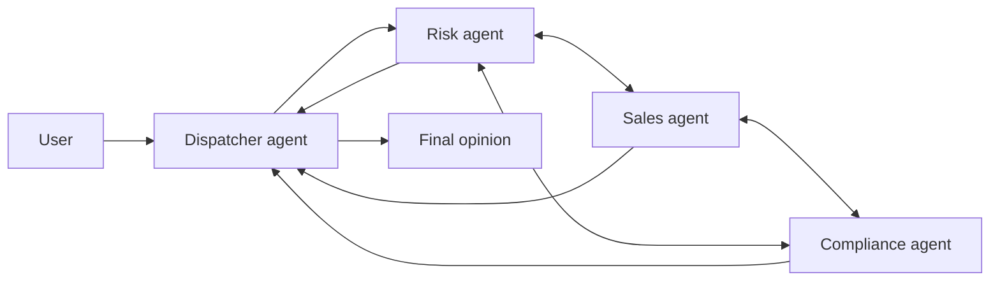

```mermaid
flowchart LR
    U["User"] --> D["Dispatcher agent"]
    D --> M["Risk agent"]
    M <--> E["Sales agent"]
    E <--> F["Compliance agent"]
    F <--> M
    M --> D
    E --> D
    F --> D
    D --> R["Final opinion"]
```
