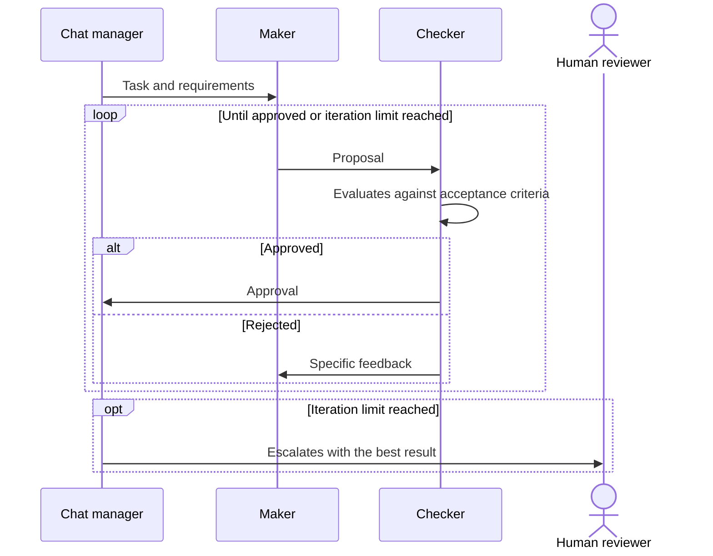

```mermaid
sequenceDiagram
    participant M as Chat manager
    participant K as Maker
    participant C as Checker
    actor H as Human reviewer
    M->>K: Task and requirements
    loop Until approved or iteration limit reached
        K->>C: Proposal
        C->>C: Evaluates against acceptance criteria
        alt Approved
            C->>M: Approval
        else Rejected
            C->>K: Specific feedback
        end
    end
    opt Iteration limit reached
        M->>H: Escalates with the best result
    end
```
