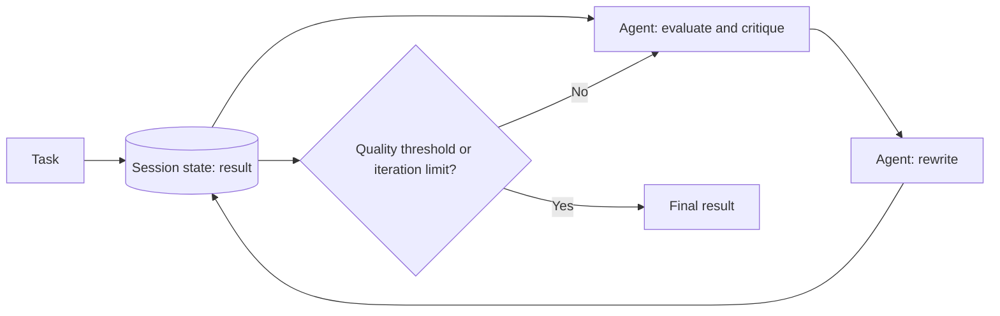

```mermaid
flowchart LR
    I["Task"] --> E[("Session state: result")]
    E --> A["Agent: evaluate and critique"]
    A --> B["Agent: rewrite"]
    B --> E
    E --> Q{"Quality threshold or iteration limit?"}
    Q -- "No" --> A
    Q -- "Yes" --> R["Final result"]
```
