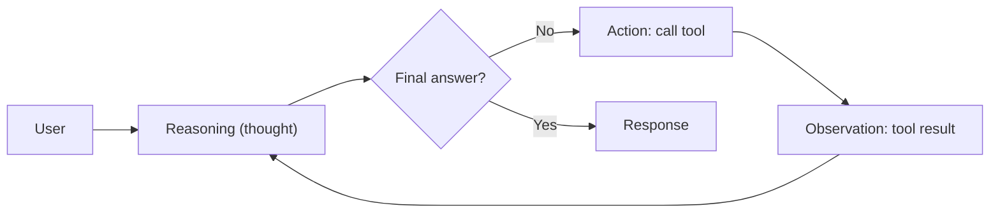

```mermaid
flowchart LR
    U["User"] --> T["Reasoning (thought)"]
    T --> D{"Final answer?"}
    D -- "No" --> A["Action: call tool"]
    A --> O["Observation: tool result"]
    O --> T
    D -- "Yes" --> R["Response"]
```
