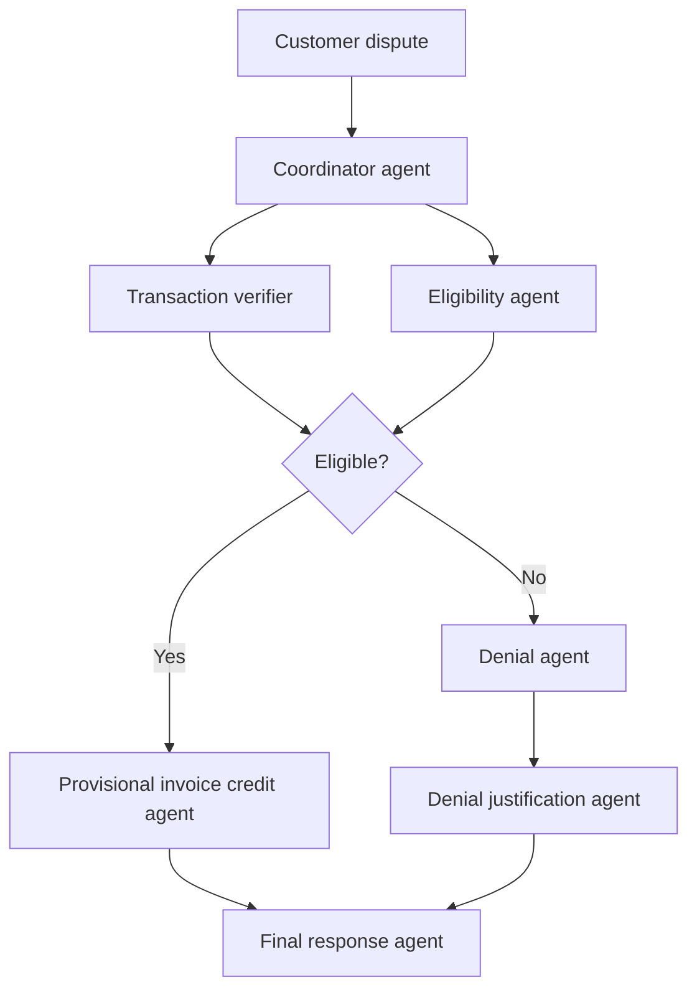

```mermaid
flowchart TD
    U["Customer dispute"] --> C["Coordinator agent"]
    C --> P1["Transaction verifier"]
    C --> P2["Eligibility agent"]
    P1 --> D{"Eligible?"}
    P2 --> D
    D -->|"Yes"| R["Provisional invoice credit agent"]
    D -->|"No"| K["Denial agent"]
    K --> K2["Denial justification agent"]
    R --> F["Final response agent"]
    K2 --> F
```
