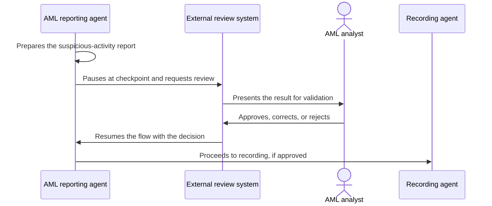

```mermaid
sequenceDiagram
    participant A1 as AML reporting agent
    participant S as External review system
    actor H as AML analyst
    participant A2 as Recording agent
    A1->>A1: Prepares the suspicious-activity report
    A1->>S: Pauses at checkpoint and requests review
    S->>H: Presents the result for validation
    H->>S: Approves, corrects, or rejects
    S->>A1: Resumes the flow with the decision
    A1->>A2: Proceeds to recording, if approved
```
