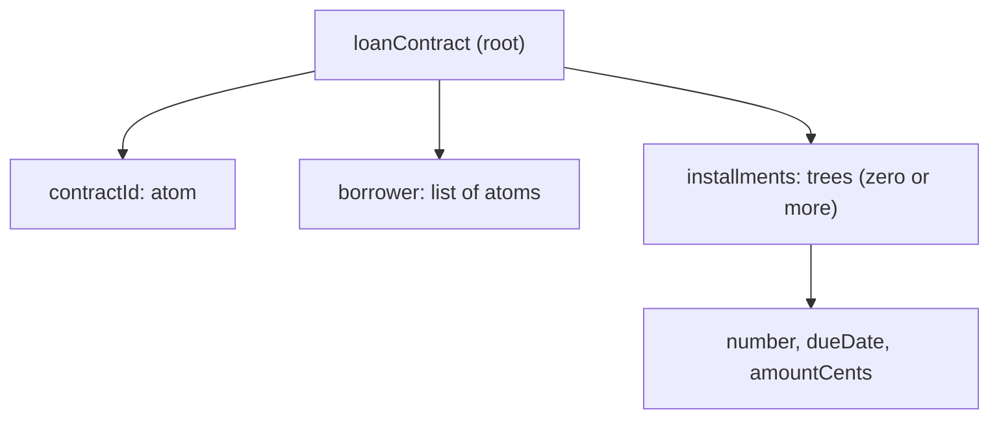

```mermaid
flowchart TB
    R["loanContract (root)"] --> I["contractId: atom"]
    R --> B["borrower: list of atoms"]
    R --> N["installments: trees (zero or more)"]
    N --> N1["number, dueDate, amountCents"]
```
