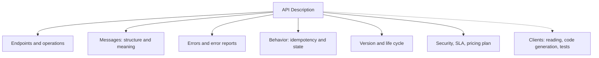

```mermaid
flowchart TB
    D["API Description"]
    D --> E["Endpoints and operations"]
    D --> M["Messages: structure and meaning"]
    D --> X["Errors and error reports"]
    D --> B["Behavior: idempotency and state"]
    D --> V["Version and life cycle"]
    D --> Q["Security, SLA, pricing plan"]
    D -.-> C["Clients: reading, code generation, tests"]
```
