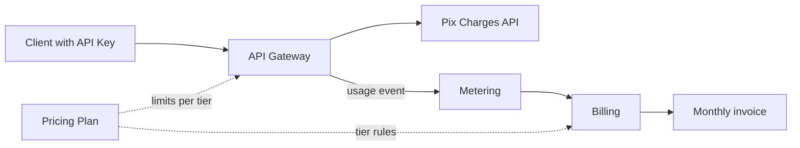

```mermaid
flowchart LR
    C["Client with API Key"] --> G["API Gateway"]
    G --> A["Pix Charges API"]
    G -->|"usage event"| M["Metering"]
    M --> B["Billing"]
    P["Pricing Plan"] -.->|"tier rules"| B
    P -.->|"limits per tier"| G
    B --> I["Monthly invoice"]
```
