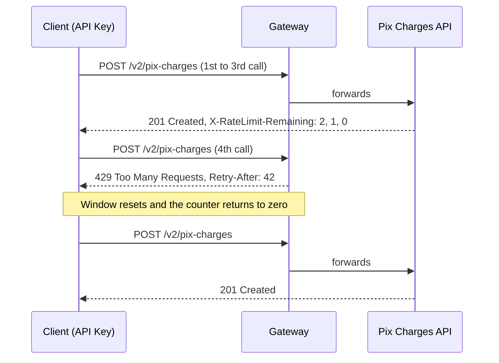

```mermaid
sequenceDiagram
    participant C as Client (API Key)
    participant G as Gateway
    participant S as Pix Charges API
    C->>G: POST /v2/pix-charges (1st to 3rd call)
    G->>S: forwards
    S-->>C: 201 Created, X-RateLimit-Remaining: 2, 1, 0
    C->>G: POST /v2/pix-charges (4th call)
    G-->>C: 429 Too Many Requests, Retry-After: 42
    Note over C,G: Window resets and the counter returns to zero
    C->>G: POST /v2/pix-charges
    G->>S: forwards
    S-->>C: 201 Created
```
