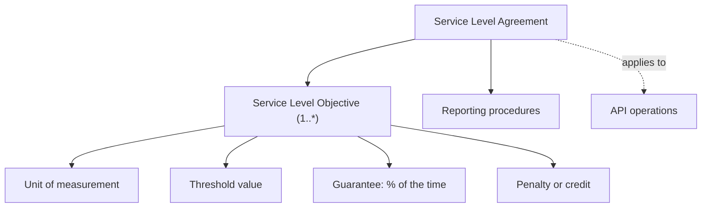

```mermaid
flowchart TB
    SLA["Service Level Agreement"] --> SLO["Service Level Objective (1..*)"]
    SLO --> U["Unit of measurement"]
    SLO --> T["Threshold value"]
    SLO --> G["Guarantee: % of the time"]
    SLO --> P["Penalty or credit"]
    SLA --> R["Reporting procedures"]
    SLA -.->|"applies to"| OP["API operations"]
```
