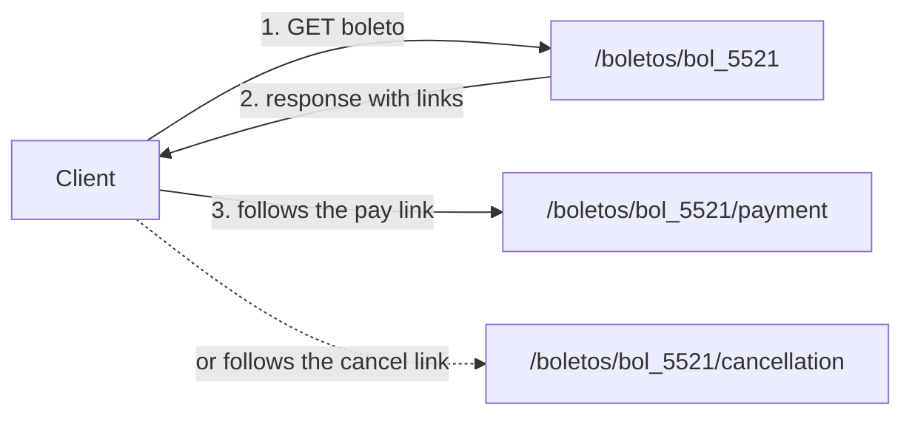

```mermaid
flowchart LR
    C["Client"] -->|"1. GET boleto"| B["/boletos/bol_5521"]
    B -->|"2. response with links"| C
    C -->|"3. follows the pay link"| P["/boletos/bol_5521/payment"]
    C -.->|"or follows the cancel link"| X["/boletos/bol_5521/cancellation"]
```
