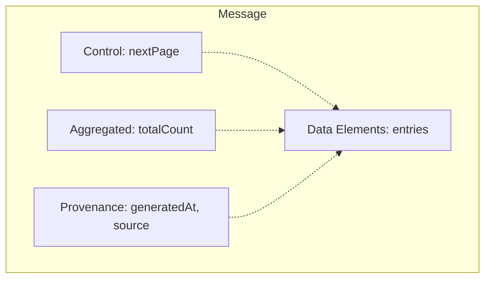

```mermaid
flowchart TB
    subgraph Message
        D["Data Elements: entries"]
        M1["Control: nextPage"]
        M2["Aggregated: totalCount"]
        M3["Provenance: generatedAt, source"]
    end
    M1 -.-> D
    M2 -.-> D
    M3 -.-> D
```
