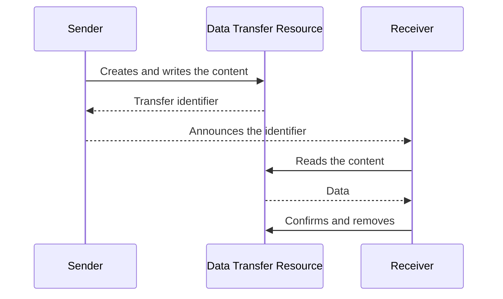

```mermaid
sequenceDiagram
    participant P as Sender
    participant T as Data Transfer Resource
    participant R as Receiver
    P->>T: Creates and writes the content
    T-->>P: Transfer identifier
    P-->>R: Announces the identifier
    R->>T: Reads the content
    T-->>R: Data
    R->>T: Confirms and removes
```
