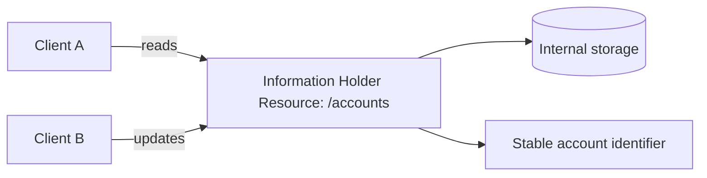

```mermaid
flowchart LR
    C1["Client A"] -->|"reads"| IH["Information Holder Resource: /accounts"]
    C2["Client B"] -->|"updates"| IH
    IH --> S[("Internal storage")]
    IH --> I["Stable account identifier"]
```
