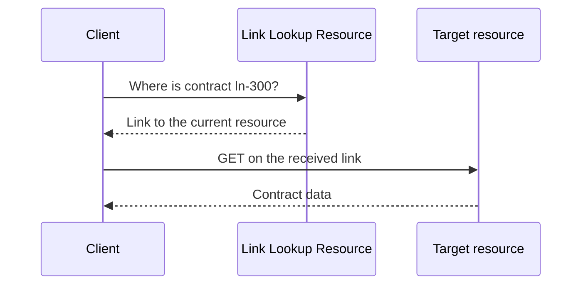

```mermaid
sequenceDiagram
    participant C as Client
    participant L as Link Lookup Resource
    participant R as Target resource
    C->>L: Where is contract ln-300?
    L-->>C: Link to the current resource
    C->>R: GET on the received link
    R-->>C: Contract data
```
