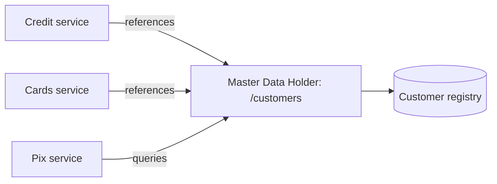

```mermaid
flowchart LR
    S1["Credit service"] -->|"references"| MD["Master Data Holder: /customers"]
    S2["Cards service"] -->|"references"| MD
    S3["Pix service"] -->|"queries"| MD
    MD --> DB[("Customer registry")]
```
