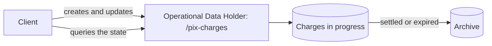

```mermaid
flowchart LR
    C["Client"] -->|"creates and updates"| OD["Operational Data Holder: /pix-charges"]
    C -->|"queries the state"| OD
    OD --> S[("Charges in progress")]
    S -->|"settled or expired"| A[("Archive")]
```
