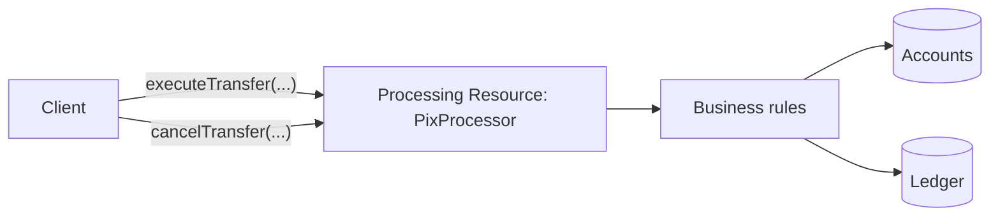

```mermaid
flowchart LR
    C["Client"] -->|"executeTransfer(...)"| PR["Processing Resource: PixProcessor"]
    C -->|"cancelTransfer(...)"| PR
    PR --> L["Business rules"]
    L --> A[("Accounts")]
    L --> E[("Ledger")]
```
