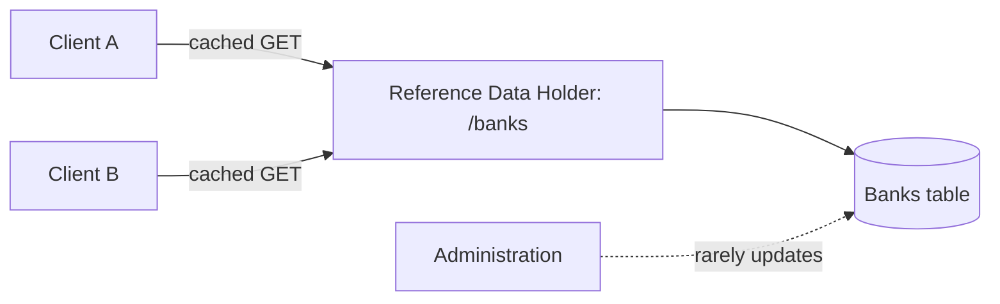

```mermaid
flowchart LR
    C1["Client A"] -->|"cached GET"| RD["Reference Data Holder: /banks"]
    C2["Client B"] -->|"cached GET"| RD
    RD --> T[("Banks table")]
    ADM["Administration"] -.->|"rarely updates"| T
```
