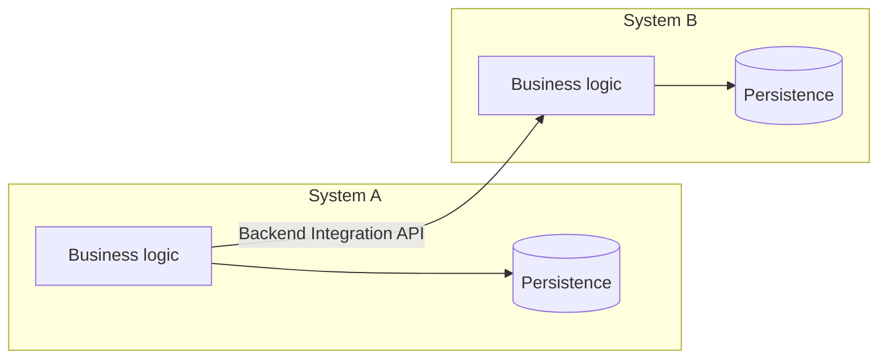

```mermaid
flowchart LR
    subgraph SystemA["System A"]
        A1["Business logic"] --> A2[("Persistence")]
    end
    subgraph SystemB["System B"]
        B1["Business logic"] --> B2[("Persistence")]
    end
    A1 -->|"Backend Integration API"| B1
```
