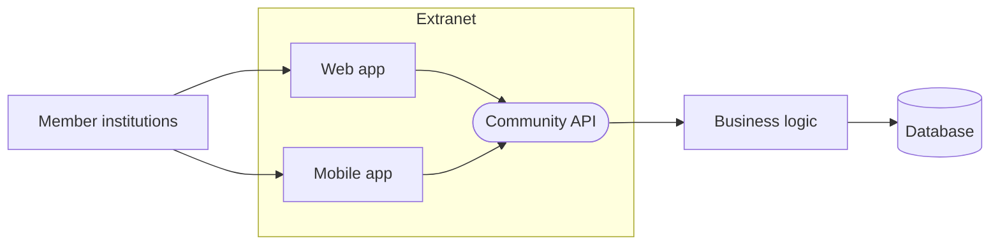

```mermaid
flowchart LR
    subgraph Extranet
        W["Web app"]
        M["Mobile app"]
        C(["Community API"])
    end
    O["Member institutions"] --> W
    O --> M
    W --> C
    M --> C
    C --> BL["Business logic"]
    BL --> DB[("Database")]
```
