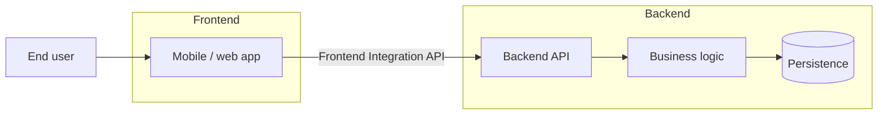

```mermaid
flowchart LR
    U["End user"] --> UI["Mobile / web app"]
    subgraph Frontend
        UI
    end
    UI -->|"Frontend Integration API"| API["Backend API"]
    subgraph Backend
        API --> BL["Business logic"]
        BL --> DB[("Persistence")]
    end
```
