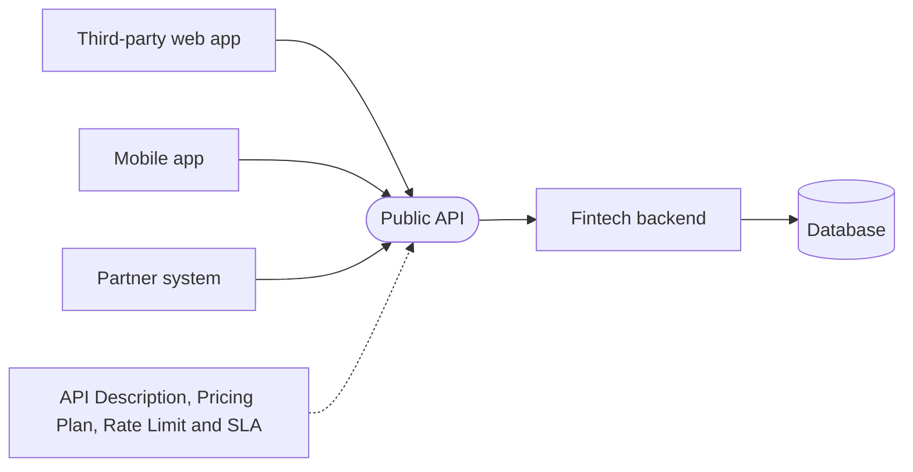

```mermaid
flowchart LR
    W["Third-party web app"] --> P
    M["Mobile app"] --> P
    S["Partner system"] --> P
    P(["Public API"]) --> BE["Fintech backend"]
    BE --> DB[("Database")]
    D["API Description, Pricing Plan, Rate Limit and SLA"] -.-> P
```
