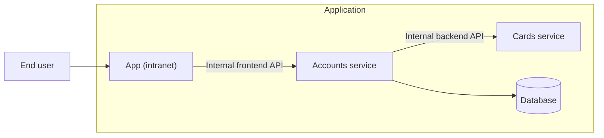

```mermaid
flowchart LR
    U["End user"] --> FE["App (intranet)"]
    subgraph Application["Application"]
        FE -->|"Internal frontend API"| S1["Accounts service"]
        S1 -->|"Internal backend API"| S2["Cards service"]
        S1 --> DB[("Database")]
    end
```
