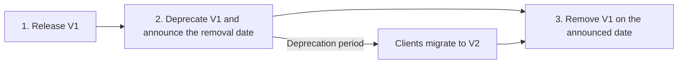

```mermaid
flowchart LR
    R["1. Release V1"] --> D["2. Deprecate V1 and announce the removal date"]
    D -->|"Deprecation period"| M["Clients migrate to V2"]
    D --> X["3. Remove V1 on the announced date"]
    M --> X
```
