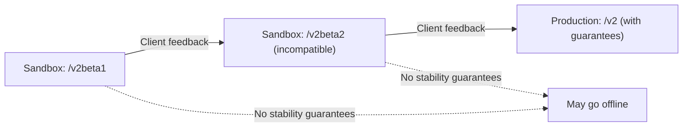

```mermaid
flowchart LR
    S["Sandbox: /v2beta1"] -->|"Client feedback"| S2["Sandbox: /v2beta2 (incompatible)"]
    S2 -->|"Client feedback"| P["Production: /v2 (with guarantees)"]
    S -.->|"No stability guarantees"| X["May go offline"]
    S2 -.->|"No stability guarantees"| X
```
