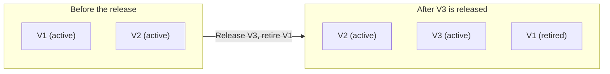

```mermaid
flowchart LR
    subgraph T1["Before the release"]
        A1["V1 (active)"]
        A2["V2 (active)"]
    end
    subgraph T2["After V3 is released"]
        B2["V2 (active)"]
        B3["V3 (active)"]
        B1["V1 (retired)"]
    end
    T1 -->|"Release V3, retire V1"| T2
```
