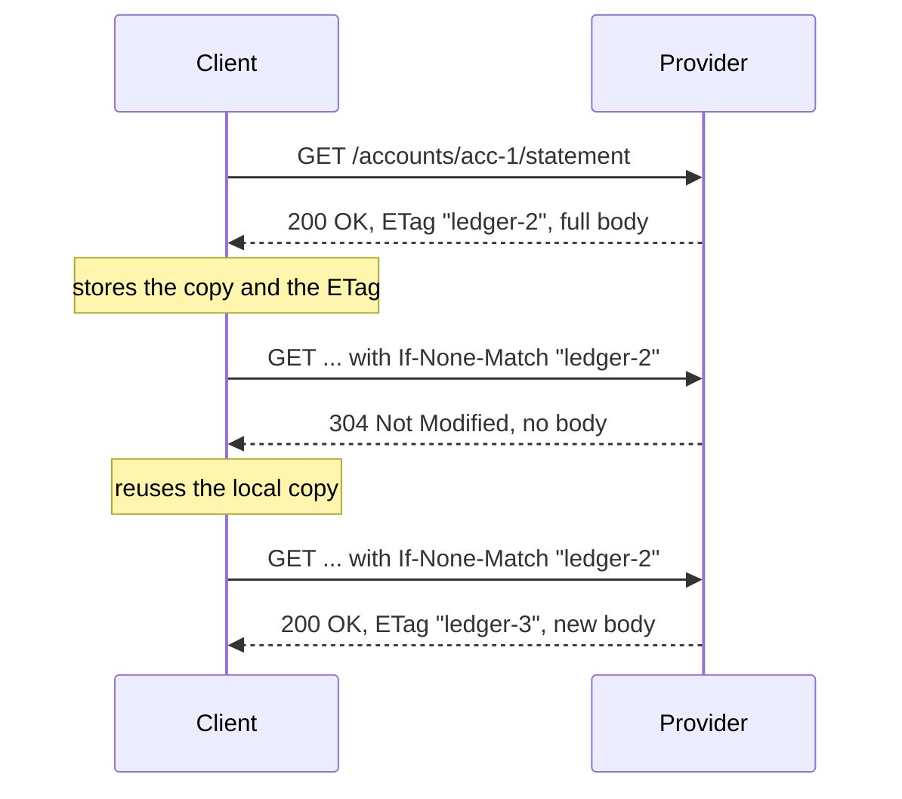

```mermaid
sequenceDiagram
    participant C as Client
    participant P as Provider
    C->>P: GET /accounts/acc-1/statement
    P-->>C: 200 OK, ETag "ledger-2", full body
    Note over C: stores the copy and the ETag
    C->>P: GET ... with If-None-Match "ledger-2"
    P-->>C: 304 Not Modified, no body
    Note over C: reuses the local copy
    C->>P: GET ... with If-None-Match "ledger-2"
    P-->>C: 200 OK, ETag "ledger-3", new body
```
