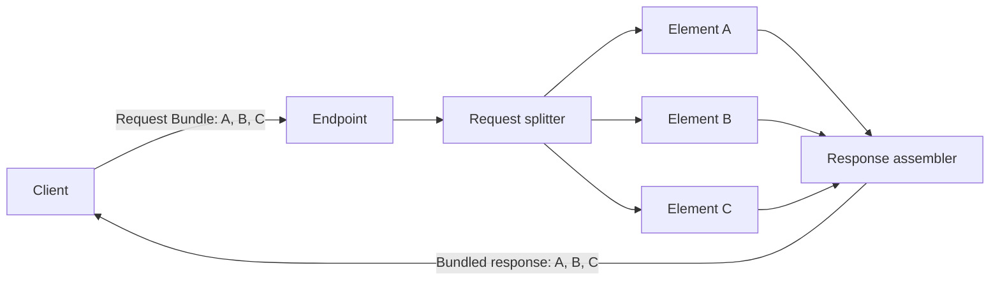

```mermaid
flowchart LR
    C["Client"] -->|"Request Bundle: A, B, C"| E["Endpoint"]
    E --> S["Request splitter"]
    S --> A1["Element A"]
    S --> B1["Element B"]
    S --> C1["Element C"]
    A1 --> M["Response assembler"]
    B1 --> M
    C1 --> M
    M -->|"Bundled response: A, B, C"| C
```
