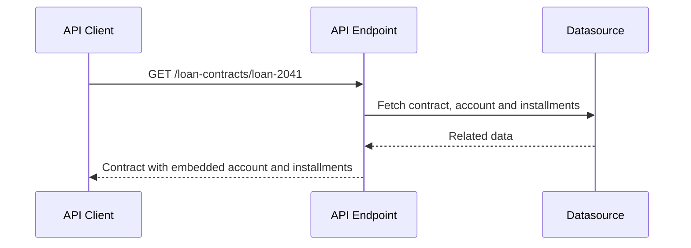

```mermaid
sequenceDiagram
    participant C as API Client
    participant E as API Endpoint
    participant D as Datasource
    C->>E: GET /loan-contracts/loan-2041
    E->>D: Fetch contract, account and installments
    D-->>E: Related data
    E-->>C: Contract with embedded account and installments
```
