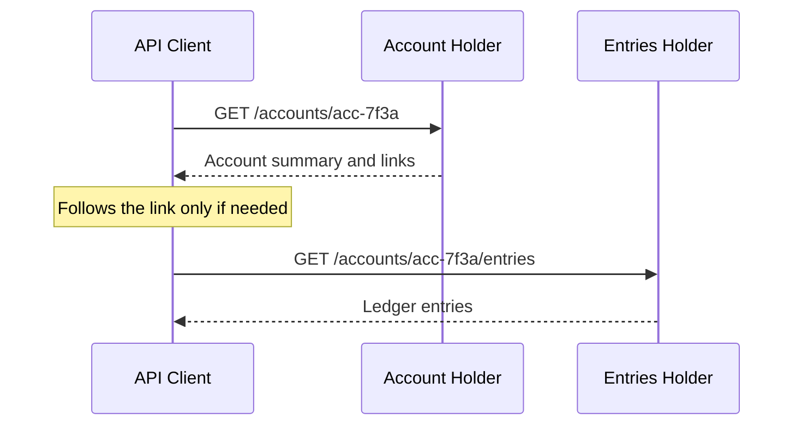

```mermaid
sequenceDiagram
    participant C as API Client
    participant A as Account Holder
    participant E as Entries Holder
    C->>A: GET /accounts/acc-7f3a
    A-->>C: Account summary and links
    Note over C: Follows the link only if needed
    C->>E: GET /accounts/acc-7f3a/entries
    E-->>C: Ledger entries
```
