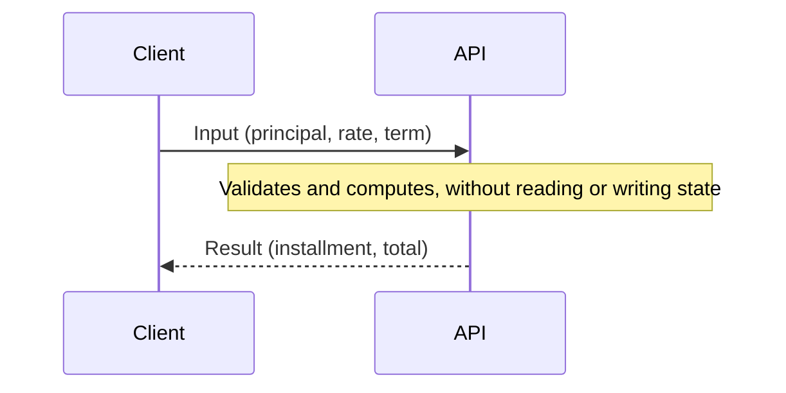

```mermaid
sequenceDiagram
    participant C as Client
    participant A as API
    C->>A: Input (principal, rate, term)
    Note over A: Validates and computes, without reading or writing state
    A-->>C: Result (installment, total)
```
