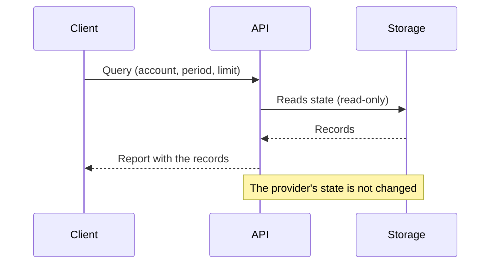

```mermaid
sequenceDiagram
    participant C as Client
    participant A as API
    participant S as Storage
    C->>A: Query (account, period, limit)
    A->>S: Reads state (read-only)
    S-->>A: Records
    A-->>C: Report with the records
    Note over A,S: The provider's state is not changed
```
