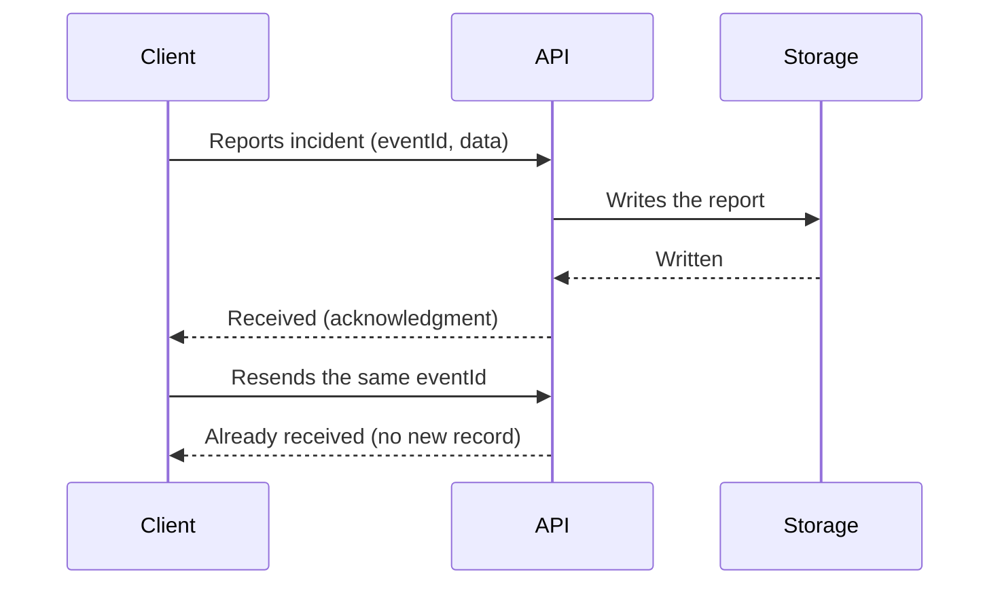

```mermaid
sequenceDiagram
    participant C as Client
    participant A as API
    participant S as Storage
    C->>A: Reports incident (eventId, data)
    A->>S: Writes the report
    S-->>A: Written
    A-->>C: Received (acknowledgment)
    C->>A: Resends the same eventId
    A-->>C: Already received (no new record)
```
