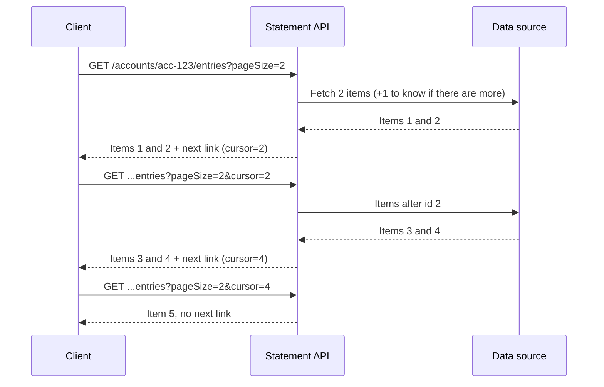

```mermaid
sequenceDiagram
    participant C as Client
    participant A as Statement API
    participant D as Data source
    C->>A: GET /accounts/acc-123/entries?pageSize=2
    A->>D: Fetch 2 items (+1 to know if there are more)
    D-->>A: Items 1 and 2
    A-->>C: Items 1 and 2 + next link (cursor=2)
    C->>A: GET ...entries?pageSize=2&cursor=2
    A->>D: Items after id 2
    D-->>A: Items 3 and 4
    A-->>C: Items 3 and 4 + next link (cursor=4)
    C->>A: GET ...entries?pageSize=2&cursor=4
    A-->>C: Item 5, no next link
```
