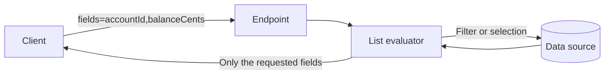

```mermaid
flowchart LR
    C["Client"] -->|"fields=accountId,balanceCents"| E["Endpoint"]
    E --> L["List evaluator"]
    L -->|"Filter or selection"| D[("Data source")]
    D --> L
    L -->|"Only the requested fields"| C
```
