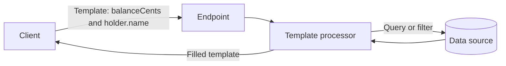

```mermaid
flowchart LR
    C["Client"] -->|"Template: balanceCents and holder.name"| E["Endpoint"]
    E --> T["Template processor"]
    T -->|"Query or filter"| D[("Data source")]
    D --> T
    T -->|"Filled template"| C
```
