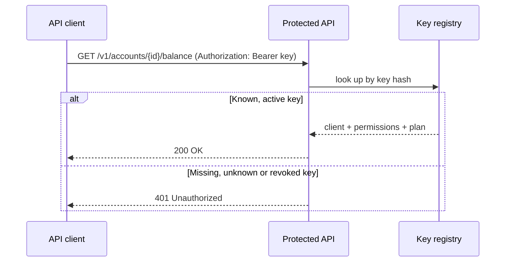

```mermaid
sequenceDiagram
    participant Cliente as API client
    participant Endpoint as Protected API
    participant Registro as Key registry
    Cliente->>Endpoint: GET /v1/accounts/{id}/balance (Authorization: Bearer key)
    Endpoint->>Registro: look up by key hash
    alt Known, active key
        Registro-->>Endpoint: client + permissions + plan
        Endpoint-->>Cliente: 200 OK
    else Missing, unknown or revoked key
        Endpoint-->>Cliente: 401 Unauthorized
    end
```
