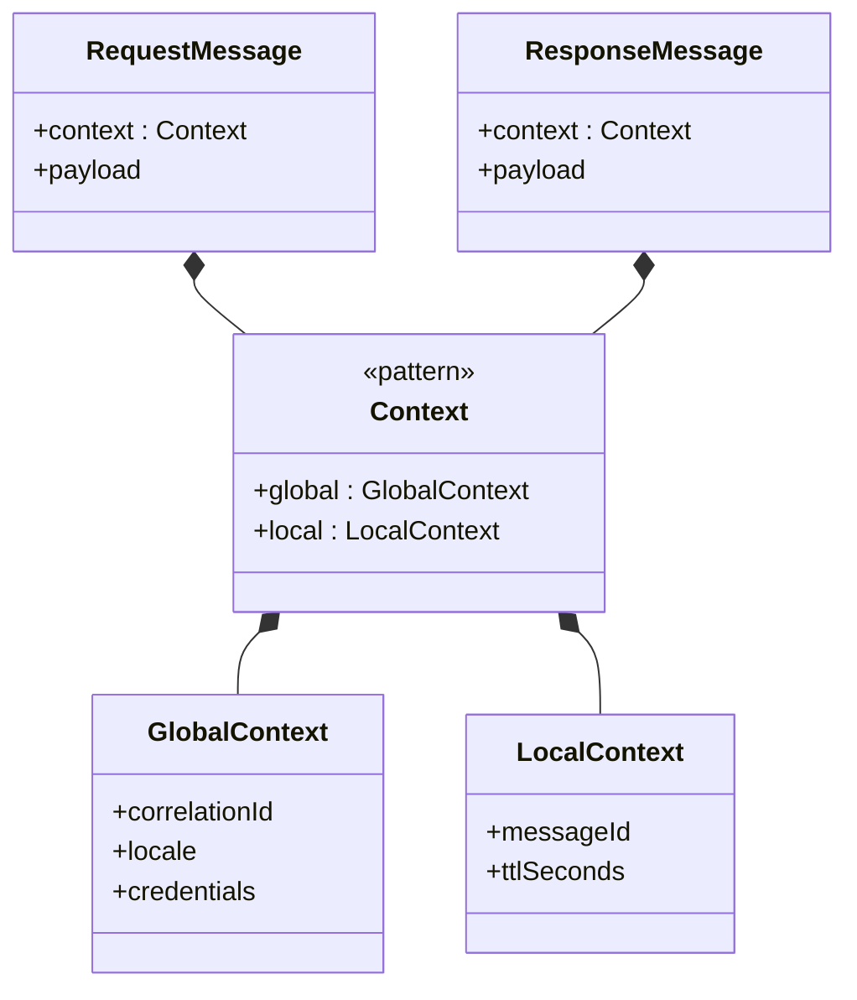

```mermaid
classDiagram
    class RequestMessage {
        +context : Context
        +payload
    }
    class ResponseMessage {
        +context : Context
        +payload
    }
    class Context {
        <<pattern>>
        +global : GlobalContext
        +local : LocalContext
    }
    class GlobalContext {
        +correlationId
        +locale
        +credentials
    }
    class LocalContext {
        +messageId
        +ttlSeconds
    }
    RequestMessage *-- Context
    ResponseMessage *-- Context
    Context *-- GlobalContext
    Context *-- LocalContext
```
