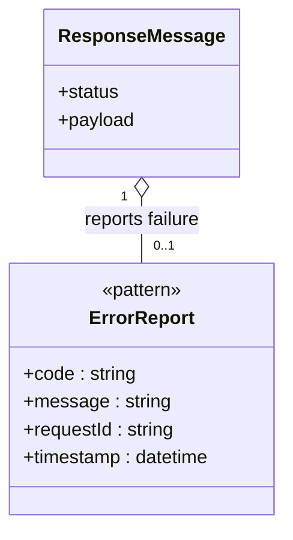

```mermaid
classDiagram
    class ResponseMessage {
        +status
        +payload
    }
    class ErrorReport {
        <<pattern>>
        +code : string
        +message : string
        +requestId : string
        +timestamp : datetime
    }
    ResponseMessage "1" o-- "0..1" ErrorReport : reports failure
```
