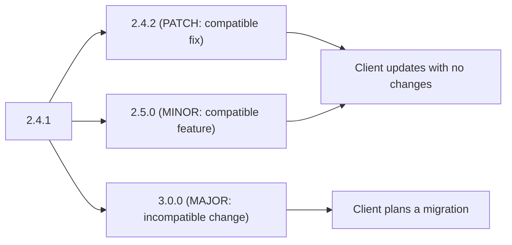

```mermaid
flowchart LR
    V["2.4.1"] --> Fix["2.4.2 (PATCH: compatible fix)"]
    V --> Feat["2.5.0 (MINOR: compatible feature)"]
    V --> Brk["3.0.0 (MAJOR: incompatible change)"]
    Fix --> OkC["Client updates with no changes"]
    Feat --> OkC
    Brk --> Mig["Client plans a migration"]
```
