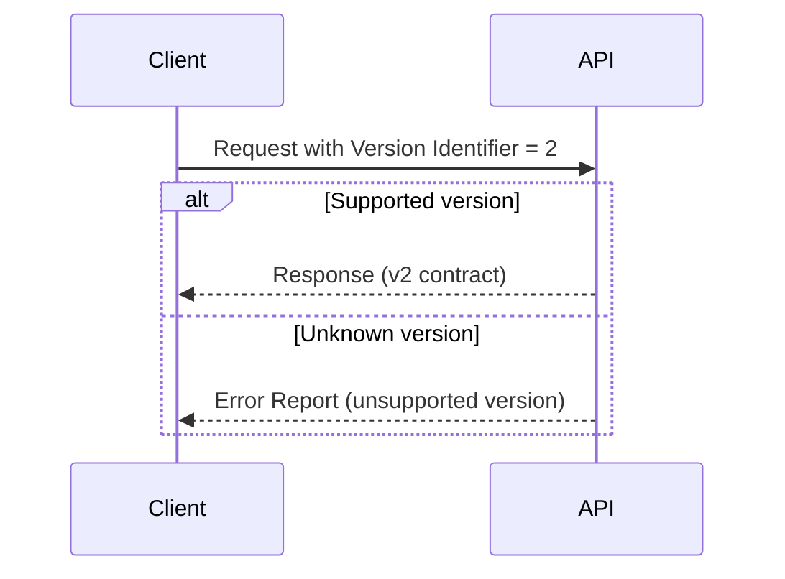

```mermaid
sequenceDiagram
    participant C as Client
    participant A as API
    C->>A: Request with Version Identifier = 2
    alt Supported version
        A-->>C: Response (v2 contract)
    else Unknown version
        A-->>C: Error Report (unsupported version)
    end
```
